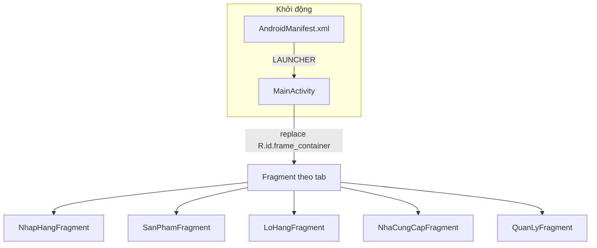

# 3. Kiến trúc code và luồng hoạt động

## Sơ đồ luồng đơn giản



Người dùng chạm tab → `MainActivity.selectTab(index)` → `loadFragment(...)` → `FragmentTransaction.replace(...)`.

## Cấu trúc thư mục Java (theo chức năng)

```
app/src/main/java/com/nhom5/pharma/
├── MainActivity.java
└── feature/
    ├── dangnhap/       DangNhapFragment.java   (chưa gắn vào MainActivity)
    ├── nhaphang/       NhapHangFragment, NhapHangAdapter, NhapHang (model)
    ├── sanpham/        SanPhamFragment.java
    ├── lohang/         LoHangFragment.java
    ├── nhacungcap/     NhaCungCapFragment.java
    └── quanly/         QuanLyFragment.java
```

Quy ước: **mỗi chức năng một package `feature.<ten>`**, gồm Fragment và (sau này) Adapter, model, repository nếu cần.

## Resource Android

- **Layout Activity chính:** `res/layout/activity_main.xml` — `FrameLayout` + thanh tab tùy chỉnh (LinearLayout).
- **Layout Fragment:** `fragment_nhap_hang.xml`, `fragment_san_pham.xml`, … — theo tên màn.
- **Item list:** ví dụ `item_nhap_hang.xml` cho một dòng trong RecyclerView đơn nhập.
- **Drawable / màu / chuỗi:** `res/drawable`, `res/values/colors.xml`, `res/values/strings.xml`.

Khi làm UI, ưu tiên chỉnh đúng layout của module đang phụ trách để hạn chế conflict khi merge.

## Điểm mở rộng hợp lý

1. **Tách logic khỏi Fragment:** Có thể thêm class `...Repository` gọi Firestore, Fragment chỉ quan sát dữ liệu và cập nhật UI.
2. **Navigation:** Hiện chỉ `replace` Fragment. Màn con (chi tiết đơn, form thêm) có thể dùng thêm Fragment chồng (back stack) hoặc Activity riêng — nhóm nên thống nhất một cách.
3. **Đăng nhập:** `DangNhapFragment` có thể được mở từ `MainActivity` trước khi hiện bottom bar, hoặc dùng Activity riêng làm launcher — cần sửa `AndroidManifest.xml` và flow điều hướng.

## File “trung tâm” cần biết

| File | Vai trò |
|------|--------|
| `MainActivity.java` | Gắn tab ↔ Fragment; màu active tab |
| `app/build.gradle` | Dependencies, `applicationId`, SDK |
| `AndroidManifest.xml` | Activity launcher, theme |
| `app/google-services.json` | Firebase (không sửa tay trừ khi đổi app/project) |

Chỉnh `MainActivity` khi thêm tab, đổi thứ tự tab, hoặc khi cần **giữ state** Fragment (hiện mỗi lần chọn tab là `new Fragment()` — state không giữ giữa lần chuyển tab).
